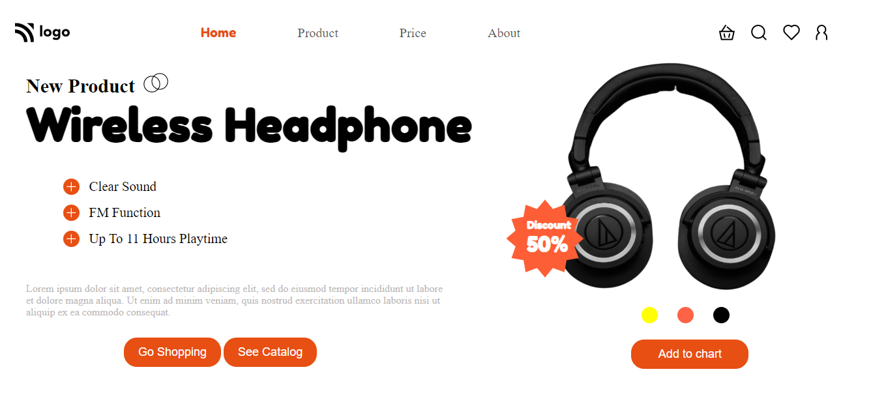

# Project 07: Product HomePage using HTML  and CSS 

Chandrakala P

## Final Look of the Webpage:

### Live project Link:

[project link](https://product-home-page-project7.netlify.app/)

## What I learnt from this Project?

- This project helped me to understand the whole idea of Html and css
- I learnt most of the basics tags in html and many properties in css.
- to understand how to use variables in CSS, and CSS selectors.
- This project helped me to understand background-img and bgc buttons text-decoration in css and also positioning in css and many more.

## Stacks and Tools:

- HTML and CSS
- HTML : list, p, div, li, ul, ol, heading tags, button, img, and many more.
- CSS: margin, padding, bgc, color, posiiton text-decorations align items, display, flex, text align, justify content, gap, bgi etc.
